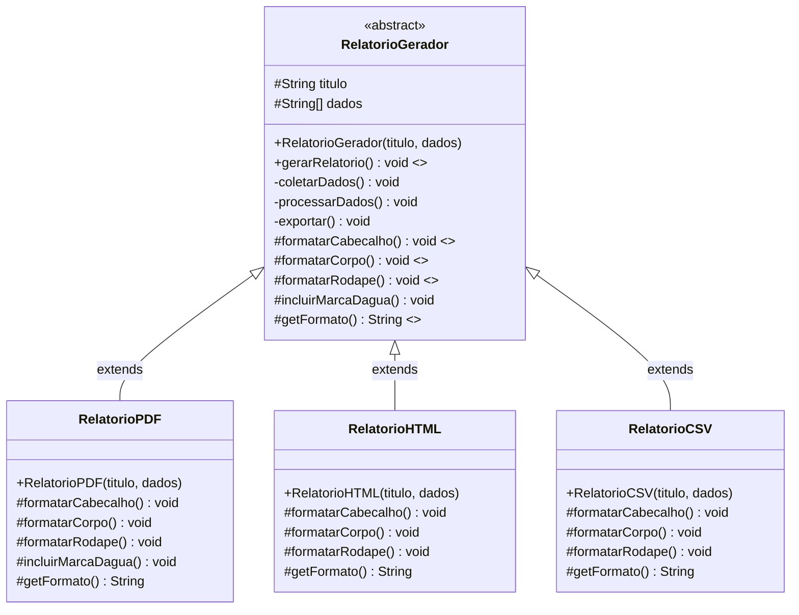
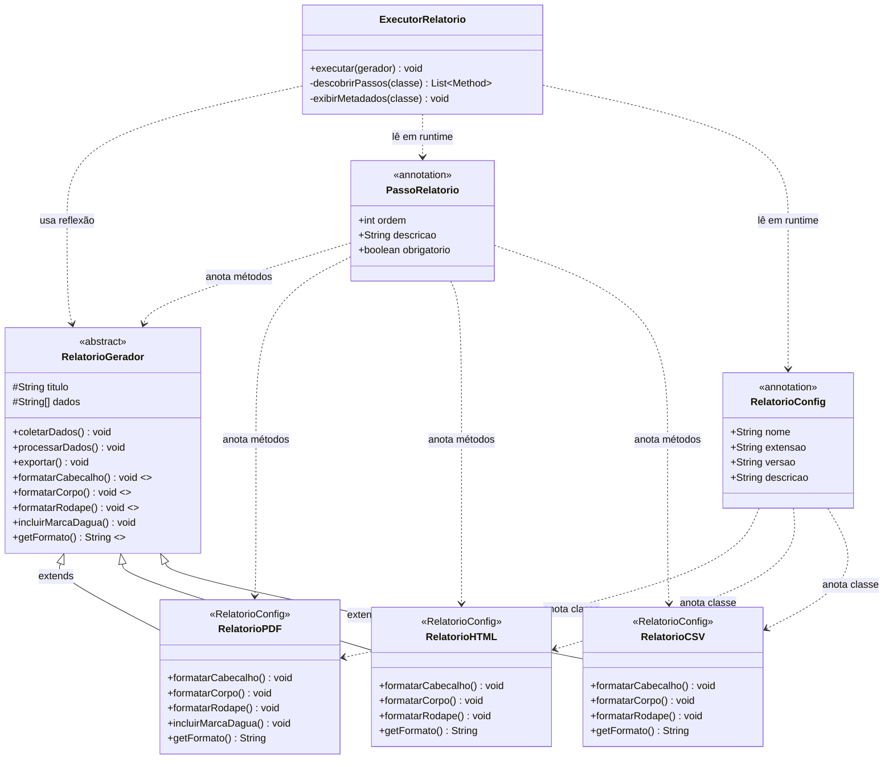
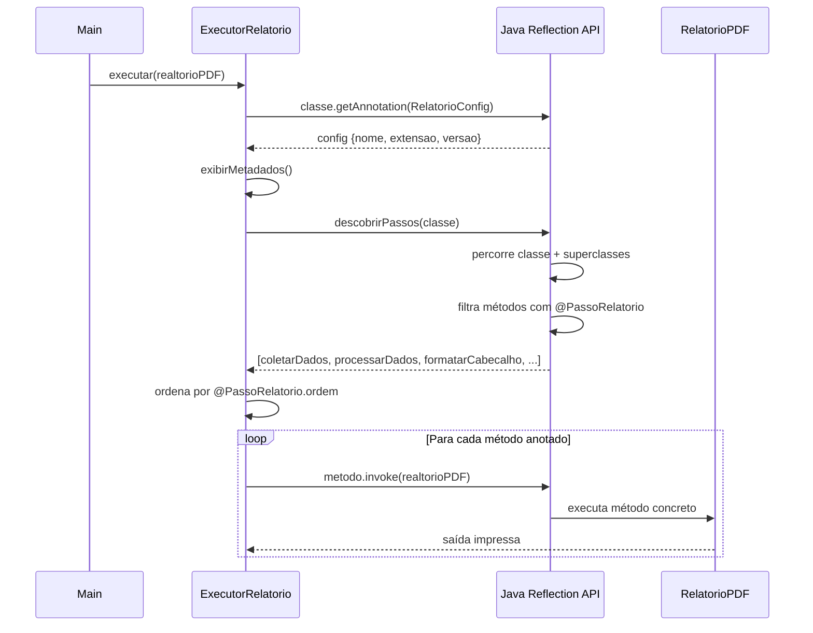

# Diagrama UML — Template Method

## Versão 2: Diagrama de Classes — Template Method Clássico

> **Nota:** `gerarRelatorio()` é marcado como `final` — nenhuma subclasse pode sobrescrever o esqueleto do algoritmo. Os métodos `formatarCabecalho()`, `formatarCorpo()` e `formatarRodape()` são `abstract` — obrigatórios nas subclasses. `incluirMarcaDagua()` é um **hook method** — tem implementação vazia padrão, mas pode ser sobrescrito (como faz RelatorioPDF).

---

## Versão 3: Diagrama de Classes — Com Reflexão e Anotações

---

## Sequência de Execução — Versão 3 (Reflexão)

